# LeaseLense — Complete Project Documentation

> For presentation preparation, team reference, and professor Q&A defense.

---

## Table of Contents

1. [What is LeaseLense?](#1-what-is-leaselense)
2. [Technology Stack](#2-technology-stack)
3. [Architecture Overview](#3-architecture-overview)
4. [The Four Layers Explained](#4-the-four-layers-explained)
5. [Database & Data Models](#5-database--data-models)
6. [Feature Walkthroughs](#6-feature-walkthroughs)
   - [Registration](#61-registration)
   - [Email Verification](#62-email-verification)
   - [Login & Logout](#63-login--logout)
   - [User Profile](#64-user-profile)
   - [Residency Verification](#65-residency-verification-address-verification)
   - [Property Directory](#66-property-directory)
   - [Reviews](#67-reviews)
   - [Scam Reports](#68-scam-reports)
   - [Reputation System](#69-reputation-system)
   - [Search](#610-search)
   - [Lease Summarizer](#611-lease-summarizer)
7. [External Services](#7-external-services)
8. [Security](#8-security)
9. [How the App Starts Up](#9-how-the-app-starts-up)
10. [Common Professor Questions — Answered](#10-common-professor-questions--answered)

---

## 1. What is LeaseLense?

LeaseLense is a **rental property transparency platform** built for renters. The core problem it solves: renters have no reliable, renter-sourced source of truth about properties and landlords before they sign a lease.

**What users can do:**
- Browse a directory of rental properties with ratings and scam severity scores
- Read and submit anonymous reviews of properties they have lived in
- Report scams associated with properties
- Verify their past residency at a property by uploading a document (bank statement, utility bill, or lease) — verified reviews carry a **"Verified Stay"** badge
- View a reputation leaderboard of the most- and least-reputable properties
- **Upload a lease document (PDF / PNG / JPEG) and receive an AI-generated summary** — rent, fees, deposits, lease term, notice requirements, move-out rules, and a colour-coded risk assessment with flagged clauses (new feature)

**The core value proposition:** Every piece of data on LeaseLense comes from real renters. Verified Stay badges give other users a signal that a review was posted by someone who actually lived at the property, not a troll or a landlord's friend. The Lease Summarizer adds a pre-signing AI layer: before a renter commits, they can get a structured breakdown of any lease in seconds.

---

## 2. Technology Stack

| Layer | Technology |
|---|---|
| Language | C# (.NET 10) |
| Web Framework | ASP.NET Core MVC |
| Database | SQL Server (via Entity Framework Core 10) |
| Authentication | ASP.NET Core Identity |
| Document AI | Azure Document Intelligence |
| LLM Extraction | Azure AI Foundry (LLM fallback for document parsing) |
| Email | Gmail SMTP (with App Password) |
| Secrets Management | Azure Key Vault |
| Hosting | Azure App Service (deployed via GitHub Actions) |
| Frontend | Razor Views (server-rendered HTML), Bootstrap CSS |

---

## 3. Architecture Overview

LeaseLense follows **Clean Architecture** — a layered design where each layer has one responsibility and outer layers depend on inner layers, never the reverse.

### C4 — System Context

*Who uses LeaseLense and what external systems does it talk to?*

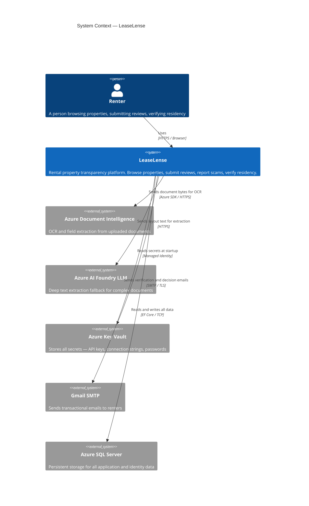
```mermaid
C4Context
    title System Context — LeaseLense

    Person(renter, "Renter", "A person browsing properties, submitting reviews, verifying residency")

    System(leaselense, "LeaseLense", "Rental property transparency platform. Browse properties, submit reviews, report scams, verify residency.")

    System_Ext(azure_di, "Azure Document Intelligence", "OCR and field extraction from uploaded documents")
    System_Ext(azure_llm, "Azure AI Foundry LLM", "Deep text extraction fallback for complex documents")
    System_Ext(azure_kv, "Azure Key Vault", "Stores all secrets — API keys, connection strings, passwords")
    System_Ext(gmail, "Gmail SMTP", "Sends transactional emails to renters")
    System_Ext(sqlserver, "Azure SQL Server", "Persistent storage for all application and identity data")

    Rel(renter, leaselense, "Uses", "HTTPS / Browser")
    Rel(leaselense, azure_di, "Sends document bytes for OCR", "Azure SDK / HTTPS")
    Rel(leaselense, azure_llm, "Sends layout text for extraction", "HTTPS")
    Rel(leaselense, azure_kv, "Reads secrets at startup", "Managed Identity")
    Rel(leaselense, gmail, "Sends verification and decision emails", "SMTP / TLS")
    Rel(leaselense, sqlserver, "Reads and writes all data", "EF Core / TCP")
```

---

### C4 — Container Diagram

*What are the internal projects (containers) inside LeaseLense?*

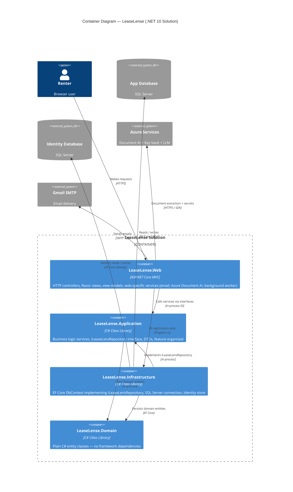
```mermaid
C4Container
    title Container Diagram — LeaseLense (.NET 10 Solution)

    Person(renter, "Renter", "Browser user")

    Container_Boundary(solution, "LeaseLense Solution") {
        Container(web, "LeaseLense.Web", "ASP.NET Core MVC", "HTTP controllers, Razor views, view models, web-specific services (email, Azure Document AI, background worker)")
        Container(app, "LeaseLense.Application", "C# Class Library", "Business logic services, ILeaseLensRepository interface, DTOs, feature-organized")
        Container(infra, "LeaseLense.Infrastructure", "C# Class Library", "EF Core DbContext implementing ILeaseLensRepository, SQL Server connection, Identity store")
        Container(domain, "LeaseLense.Domain", "C# Class Library", "Plain C# entity classes — no framework dependencies")
    }

    SystemDb_Ext(appdb, "App Database", "SQL Server", "Properties, reviews, renters, scam reports, verifications")
    SystemDb_Ext(authdb, "Identity Database", "SQL Server", "ASP.NET Identity — users, hashed passwords, email tokens")
    System_Ext(azure, "Azure Services", "Document AI + Key Vault + LLM")
    System_Ext(gmail, "Gmail SMTP", "Email delivery")

    Rel(renter, web, "Makes requests", "HTTPS")
    Rel(web, app, "Calls services via interfaces", "In-process DI")
    Rel(app, domain, "Uses domain entities", "In-process")
    Rel(infra, app, "Implements ILeaseLensRepository", "In-process")
    Rel(infra, domain, "Persists domain entities", "EF Core")
    Rel(web, infra, "DI registration only", "Program.cs")
    Rel(infra, appdb, "Reads / writes", "EF Core / SQL")
    Rel(infra, authdb, "Identity reads / writes", "EF Core Identity")
    Rel(web, azure, "Document extraction + secrets", "HTTPS / SDK")
    Rel(web, gmail, "Sends emails", "SMTP TLS")
```

---

### Layer Dependency Rule

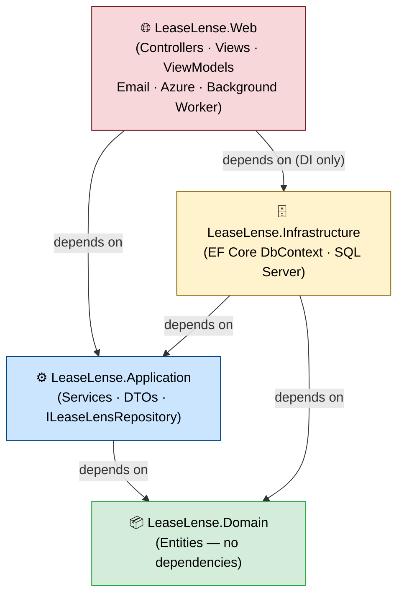
```mermaid
flowchart TD
    Web["🌐 LeaseLense.Web\n(Controllers · Views · ViewModels\nEmail · Azure · Background Worker)"]
    App["⚙️ LeaseLense.Application\n(Services · DTOs · ILeaseLensRepository)"]
    Infra["🗄️ LeaseLense.Infrastructure\n(EF Core DbContext · SQL Server)"]
    Domain["📦 LeaseLense.Domain\n(Entities — no dependencies)"]

    Web -->|"depends on"| App
    Web -->|"depends on (DI only)"| Infra
    App -->|"depends on"| Domain
    Infra -->|"depends on"| App
    Infra -->|"depends on"| Domain

    style Domain fill:#d4edda,stroke:#28a745,color:#000
    style App fill:#cce5ff,stroke:#004085,color:#000
    style Infra fill:#fff3cd,stroke:#856404,color:#000
    style Web fill:#f8d7da,stroke:#721c24,color:#000
```

> **The golden rule:** Arrows point inward. Domain knows nothing. Application knows Domain but not EF Core. Infrastructure implements Application's interfaces. Web only wires things up in `Program.cs`.

---

## 4. The Four Layers Explained

### Layer 1 — Domain (`LeaseLense.Domain`)

Plain C# entity classes. No NuGet packages. No EF Core attributes. Just data shapes.

**Entities:**

| Entity | Represents |
|---|---|
| `Renter` | A registered user on the platform |
| `Property` | A rental unit or building |
| `Community` | An apartment complex grouping multiple properties |
| `Review` | A renter's written review of a property |
| `ReviewRating` | A numeric score dimension on a review |
| `ReviewIssueTag` | A tagged problem (mold, pests, noise, etc.) |
| `ScamReport` | A fraud/scam report linked to a property |
| `ScamEvidence` | A file attached to a scam report |
| `RenterPropertyVerification` | The result of a residency verification attempt |
| `ResidencyVerificationDocument` | Metadata about the uploaded proof document |
| `LeaseDocument` | An uploaded lease file |
| `LeaseAnalysis` | AI-generated lease risk analysis |
| `LeaseClauseFlag` | A specific risky clause flagged in a lease |
| `LeaseDocument` | An uploaded lease file (bytes never written to disk — metadata + hash stored) |
| `LeaseSummarizationJob` | Tracks the async processing status of a lease analysis job |
| `LeaseAnalysis` | AI-generated structured summary + risk score for a lease |
| `LeaseClauseFlag` | A specific risky clause extracted from a lease (with risk level, explanation, suggested question) |
| `NegotiationSession` | A lease negotiation guidance session |
| `NegotiationSuggestion` | A suggested action from a negotiation session |

---

### Layer 2 — Application (`LeaseLense.Application`)

The brain of the app. Contains all business logic. Has zero EF Core or HTTP imports.

**Key contract — `ILeaseLensRepository`:**  
Defined in `Application/Abstractions/`. Lists every data operation the business logic needs. Infrastructure implements it. Services only ever call this interface.

**Services:**

| Service | Responsibility |
|---|---|
| `CoreSearchService` | In-memory text + filter search across properties, reviews, scam reports |
| `HomePageReadService` | Fetches the latest 6 properties, 3 reviews, 3 scam reports for the home page |
| `PropertyReadService` | Full property list |
| `PropertyDirectoryService` | Property search + detailed property profile (reviews + scams) |
| `ReviewMvpService` | List/filter/sort reviews; submit a new review |
| `ScamReportMvpService` | List/filter scam reports; submit a new scam report |
| `ReputationMvpService` | Compute reputation scores for all properties |
| `ProfileService` | Load/update user profile; run residency verification scoring logic |
| `UserAccountService` | Ensure a `Renter` record exists for a logged-in IdentityUser |

---

### Layer 3 — Infrastructure (`LeaseLense.Infrastructure`)

Everything that talks to SQL Server.

- `LeaseLensDbContext` — implements `ILeaseLensRepository` using EF Core. Contains all table mappings, column names, constraints, and foreign key relationships.
- `AuthDbContext` — separate EF Core context for ASP.NET Identity (users, passwords, tokens).
- `DependencyInjection.cs` — registers both DbContexts and wires `ILeaseLensRepository → LeaseLensDbContext`.

---

### Layer 4 — Web (`LeaseLense.Web`)

HTTP request handling, views, and web-specific services.

**Controllers:** `AccountController`, `HomeController`, `PropertiesController`, `ReviewsController`, `ScamReportsController`, `ProfileController`, `LeaseSummarizerController`

**Web services:** `GmailEmailVerificationSender`, `AzureDocumentIntelligenceExtractionService`, `AzureFoundryAddressExtractionLlmClient`, `ResidencyFallbackWorker`, `KeyVaultSecretLoader`, `AzureFoundryLeaseSummarizationLlmClient`, `LeaseSummarizationQueue`, `LeaseSummarizationWorker`

---

## 5. Database & Data Models

LeaseLense uses **two separate SQL Server databases**:

1. **`LeaseLensDbContext`** — all application data
2. **`AuthDbContext`** — ASP.NET Identity (users, hashed passwords, tokens). Kept separate so the auth system can evolve independently.

### Entity Relationship Diagram

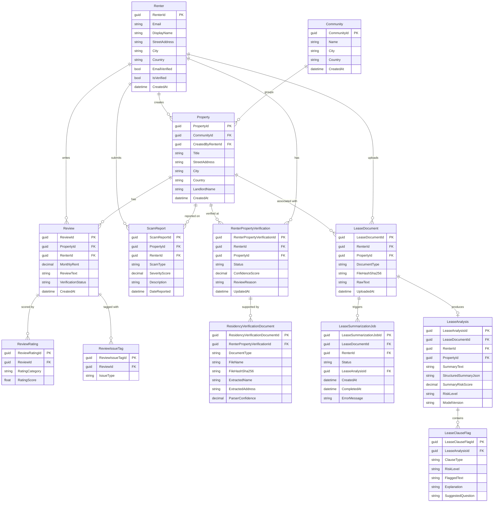
```mermaid
erDiagram
    Community {
        guid CommunityId PK
        string Name
        string City
        string Country
        datetime CreatedAt
    }
    Property {
        guid PropertyId PK
        guid CommunityId FK
        guid CreatedByRenterId FK
        string Title
        string StreetAddress
        string City
        string Country
        string LandlordName
        datetime CreatedAt
    }
    Renter {
        guid RenterId PK
        string Email
        string DisplayName
        string StreetAddress
        string City
        string Country
        bool EmailVerified
        bool IsVerified
        datetime CreatedAt
    }
    Review {
        guid ReviewId PK
        guid PropertyId FK
        guid RenterId FK
        decimal MonthlyRent
        string ReviewText
        string VerificationStatus
        datetime CreatedAt
    }
    ReviewRating {
        guid ReviewRatingId PK
        guid ReviewId FK
        string RatingCategory
        float RatingScore
    }
    ReviewIssueTag {
        guid ReviewIssueTagId PK
        guid ReviewId FK
        string IssueType
    }
    ScamReport {
        guid ScamReportId PK
        guid PropertyId FK
        guid RenterId FK
        string ScamType
        decimal SeverityScore
        string Description
        datetime DateReported
    }
    RenterPropertyVerification {
        guid RenterPropertyVerificationId PK
        guid RenterId FK
        guid PropertyId FK
        string Status
        decimal ConfidenceScore
        string ReviewReason
        datetime UpdatedAt
    }
    ResidencyVerificationDocument {
        guid ResidencyVerificationDocumentId PK
        guid RenterPropertyVerificationId FK
        string DocumentType
        string FileName
        string FileHashSha256
        string ExtractedName
        string ExtractedAddress
        decimal ParserConfidence
    }

    LeaseDocument {
        guid LeaseDocumentId PK
        guid RenterId FK
        guid PropertyId FK
        string DocumentType
        string FileHashSha256
        string RawText
        datetime UploadedAt
    }
    LeaseSummarizationJob {
        guid LeaseSummarizationJobId PK
        guid LeaseDocumentId FK
        guid RenterId FK
        string Status
        guid LeaseAnalysisId FK
        datetime CreatedAt
        datetime CompletedAt
        string ErrorMessage
    }
    LeaseAnalysis {
        guid LeaseAnalysisId PK
        guid LeaseDocumentId FK
        guid RenterId FK
        guid PropertyId FK
        string SummaryText
        string StructuredSummaryJson
        decimal SummaryRiskScore
        string RiskLevel
        string ModelVersion
    }
    LeaseClauseFlag {
        guid LeaseClauseFlagId PK
        guid LeaseAnalysisId FK
        string ClauseType
        string RiskLevel
        string FlaggedText
        string Explanation
        string SuggestedQuestion
    }

    Community ||--o{ Property : "groups"
    Renter ||--o{ Property : "creates"
    Property ||--o{ Review : "has"
    Renter ||--o{ Review : "writes"
    Review ||--o{ ReviewRating : "scored by"
    Review ||--o{ ReviewIssueTag : "tagged with"
    Property ||--o{ ScamReport : "reported on"
    Renter ||--o{ ScamReport : "submits"
    Renter ||--o{ RenterPropertyVerification : "has"
    Property ||--o{ RenterPropertyVerification : "verified at"
    RenterPropertyVerification ||--o{ ResidencyVerificationDocument : "supported by"
    Renter ||--o{ LeaseDocument : "uploads"
    Property ||--o{ LeaseDocument : "associated with"
    LeaseDocument ||--o{ LeaseSummarizationJob : "triggers"
    LeaseDocument ||--o| LeaseAnalysis : "produces"
    LeaseAnalysis ||--o{ LeaseClauseFlag : "contains"
```

---

## 6. Feature Walkthroughs

---

### 6.1 Registration

**What happens when a user registers:**

1. User fills in the Register form (email, display name, password).
2. ASP.NET Identity hashes the password and creates an `IdentityUser` in `AuthDbContext`.
3. `UserAccountService` creates a matching `Renter` record in `LeaseLensDbContext` — this is the application-level profile.
4. A cryptographically signed **email confirmation token** is generated, Base64-URL encoded, and embedded in a callback URL.
5. `GmailEmailVerificationSender` sends the verification email.
6. User is redirected back to Register with a success message and must verify email before logging in.

**Why two user records (IdentityUser + Renter)?**  
ASP.NET Identity handles authentication only. The `Renter` entity is LeaseLense's view of the user — it stores the display name, address (for verification matching), and verification status. These are application concepts that don't belong in the auth system.

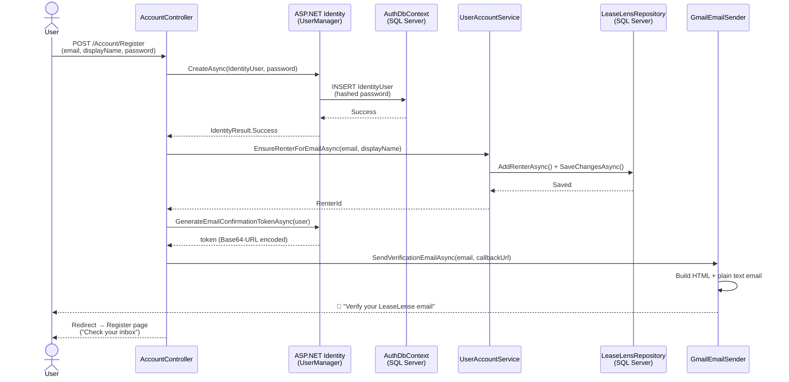
```mermaid
sequenceDiagram
    actor User
    participant Web as AccountController
    participant Identity as ASP.NET Identity<br/>(UserManager)
    participant AuthDB as AuthDbContext<br/>(SQL Server)
    participant UAS as UserAccountService
    participant AppDB as LeaseLensRepository<br/>(SQL Server)
    participant Email as GmailEmailSender

    User->>Web: POST /Account/Register<br/>(email, displayName, password)
    Web->>Identity: CreateAsync(IdentityUser, password)
    Identity->>AuthDB: INSERT IdentityUser<br/>(hashed password)
    AuthDB-->>Identity: Success
    Identity-->>Web: IdentityResult.Success

    Web->>UAS: EnsureRenterForEmailAsync(email, displayName)
    UAS->>AppDB: AddRenterAsync() + SaveChangesAsync()
    AppDB-->>UAS: Saved
    UAS-->>Web: RenterId

    Web->>Identity: GenerateEmailConfirmationTokenAsync(user)
    Identity-->>Web: token (Base64-URL encoded)

    Web->>Email: SendVerificationEmailAsync(email, callbackUrl)
    Email->>Email: Build HTML + plain text email
    Email-->>User: 📧 "Verify your LeaseLense email"

    Web-->>User: Redirect → Register page<br/>("Check your inbox")
```

---

### 6.2 Email Verification

**What happens when the user clicks the verification link:**

The link is `/Account/VerifyEmail?userId=...&token=...`

1. Controller decodes the Base64-URL token back to a UTF-8 string.
2. `UserManager.ConfirmEmailAsync()` validates the token — it is cryptographically tied to the user ID and email.
3. `IdentityUser.EmailConfirmed` is set to `true` in `AuthDbContext`.
4. `UserAccountService` updates `Renter.EmailVerified = true` in `LeaseLensDbContext`.
5. User is redirected to Login.

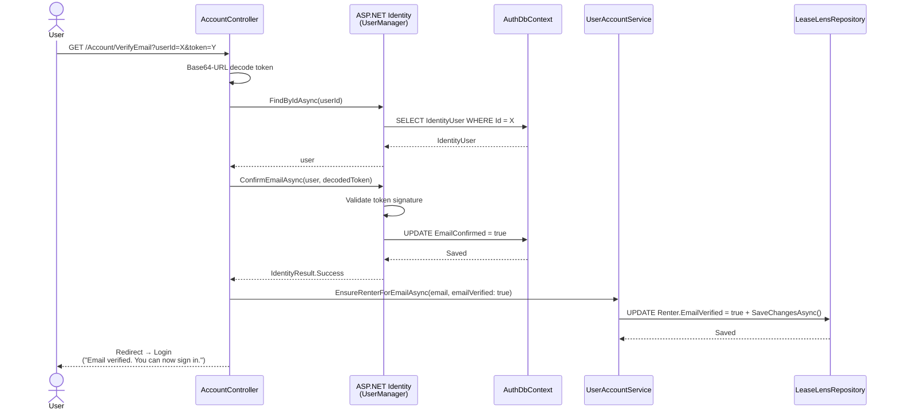
```mermaid
sequenceDiagram
    actor User
    participant Web as AccountController
    participant Identity as ASP.NET Identity<br/>(UserManager)
    participant AuthDB as AuthDbContext
    participant UAS as UserAccountService
    participant AppDB as LeaseLensRepository

    User->>Web: GET /Account/VerifyEmail?userId=X&token=Y
    Web->>Web: Base64-URL decode token

    Web->>Identity: FindByIdAsync(userId)
    Identity->>AuthDB: SELECT IdentityUser WHERE Id = X
    AuthDB-->>Identity: IdentityUser
    Identity-->>Web: user

    Web->>Identity: ConfirmEmailAsync(user, decodedToken)
    Identity->>Identity: Validate token signature
    Identity->>AuthDB: UPDATE EmailConfirmed = true
    AuthDB-->>Identity: Saved
    Identity-->>Web: IdentityResult.Success

    Web->>UAS: EnsureRenterForEmailAsync(email, emailVerified: true)
    UAS->>AppDB: UPDATE Renter.EmailVerified = true + SaveChangesAsync()
    AppDB-->>UAS: Saved

    Web-->>User: Redirect → Login<br/>("Email verified. You can now sign in.")
```

---

### 6.3 Login & Logout

**Login** uses ASP.NET Identity's `SignInManager` which validates the hashed password and writes a secure authentication cookie to the browser.

**Why block login on unverified email?**  
`PasswordSignInAsync` would actually succeed even with an unverified email — the controller checks `IsEmailConfirmedAsync()` separately and shows a specific error. This forces users to verify before accessing the platform.

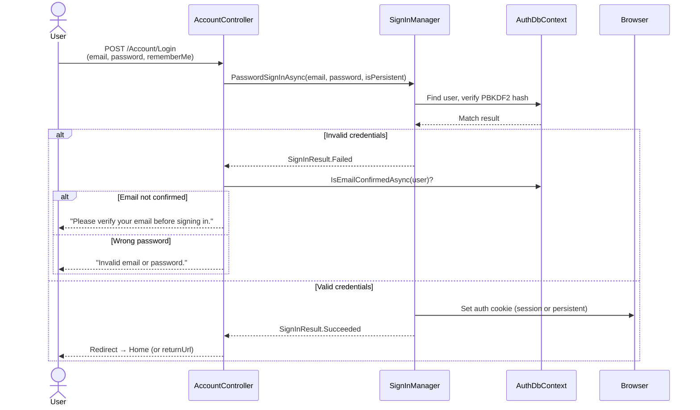
```mermaid
sequenceDiagram
    actor User
    participant Web as AccountController
    participant SM as SignInManager
    participant AuthDB as AuthDbContext
    participant Browser

    User->>Web: POST /Account/Login<br/>(email, password, rememberMe)

    Web->>SM: PasswordSignInAsync(email, password, isPersistent)
    SM->>AuthDB: Find user, verify PBKDF2 hash
    AuthDB-->>SM: Match result

    alt Invalid credentials
        SM-->>Web: SignInResult.Failed
        Web->>AuthDB: IsEmailConfirmedAsync(user)?
        alt Email not confirmed
            Web-->>User: "Please verify your email before signing in."
        else Wrong password
            Web-->>User: "Invalid email or password."
        end
    else Valid credentials
        SM->>Browser: Set auth cookie (session or persistent)
        SM-->>Web: SignInResult.Succeeded
        Web-->>User: Redirect → Home (or returnUrl)
    end
```

**Logout:**

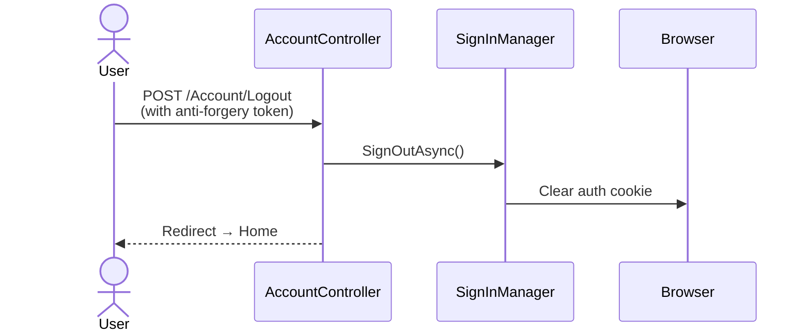
```mermaid
sequenceDiagram
    actor User
    participant Web as AccountController
    participant SM as SignInManager
    participant Browser

    User->>Web: POST /Account/Logout<br/>(with anti-forgery token)
    Web->>SM: SignOutAsync()
    SM->>Browser: Clear auth cookie
    Web-->>User: Redirect → Home
```

---

### 6.4 User Profile

The profile page has three actions:

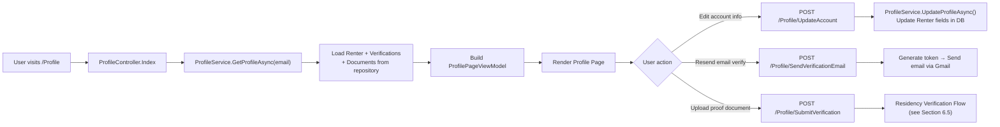
```mermaid
flowchart LR
    A["User visits /Profile"] --> B["ProfileController.Index"]
    B --> C["ProfileService.GetProfileAsync(email)"]
    C --> D["Load Renter + Verifications\n+ Documents from repository"]
    D --> E["Build ProfilePageViewModel"]
    E --> F["Render Profile Page"]

    F --> G{"User action"}
    G -->|"Edit account info"| H["POST /Profile/UpdateAccount"]
    G -->|"Resend email verify"| I["POST /Profile/SendVerificationEmail"]
    G -->|"Upload proof document"| J["POST /Profile/SubmitVerification"]

    H --> K["ProfileService.UpdateProfileAsync()\nUpdate Renter fields in DB"]
    I --> L["Generate token → Send email via Gmail"]
    J --> M["Residency Verification Flow\n(see Section 6.5)"]
```

**Name Lock:** Once a renter achieves `verified_stay` status, `ProfileService.UpdateProfileAsync()` permanently blocks display name changes. This prevents changing identity after earning a Verified Stay badge.

---

### 6.5 Residency Verification (Address Verification)

This is the most complex feature. Its goal: let renters prove they lived at a specific property so their reviews show a "Verified Stay" badge.

#### Full Flow Overview

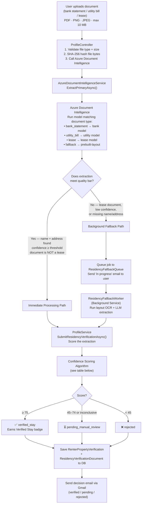
```mermaid
flowchart TD
    A["User uploads document\n(bank statement / utility bill / lease)\nPDF · PNG · JPEG · max 10 MB"] --> B["ProfileController\n1. Validate file type + size\n2. SHA-256 hash file bytes\n3. Call Azure Document Intelligence"]

    B --> C["AzureDocumentIntelligenceService\nExtractPrimaryAsync()"]

    C --> D["Azure Document Intelligence\nRun model matching document type:\n• bank_statement → bank model\n• utility_bill → utility model\n• lease → lease model\n• fallback → prebuilt-layout"]

    D --> E{"Does extraction\nmeet quality bar?"}

    E -->|"Yes — name + address found\nconfidence ≥ threshold\ndocument is NOT a lease"| F["Immediate Processing Path"]
    E -->|"No — lease document,\nlow confidence,\nor missing name/address"| G["Background Fallback Path"]

    F --> H["ProfileService\nSubmitResidencyVerificationAsync()\nScore the extraction"]
    G --> I["Queue job to ResidencyFallbackQueue\nSend 'in progress' email to user"]
    I --> J["ResidencyFallbackWorker\n(Background Service)\nRun layout OCR + LLM extraction"]
    J --> H

    H --> K["Confidence Scoring Algorithm\n(see table below)"]
    K --> L{"Score?"}
    L -->|"≥ 75"| M["✅ verified_stay\nEarns Verified Stay badge"]
    L -->|"45–74 or inconclusive"| N["⏳ pending_manual_review"]
    L -->|"< 45"| O["❌ rejected"]

    M & N & O --> P["Save RenterPropertyVerification\n+ ResidencyVerificationDocument to DB"]
    P --> Q["Send decision email via Gmail\n(verified / pending / rejected)"]
```

#### Azure Document Intelligence — What It Does

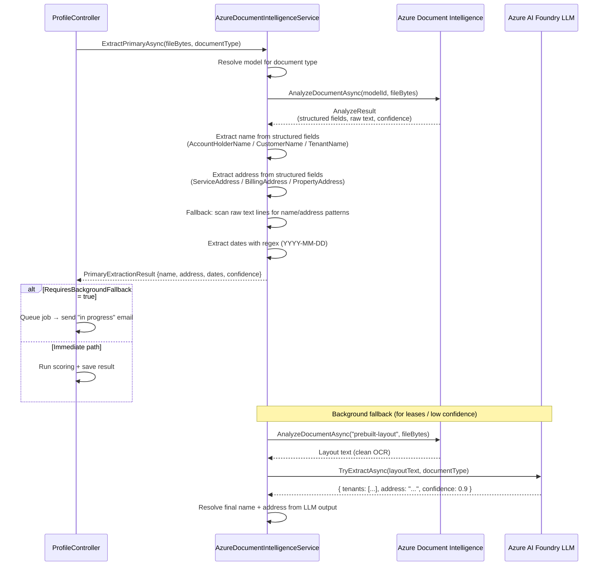
```mermaid
sequenceDiagram
    participant Ctrl as ProfileController
    participant Svc as AzureDocumentIntelligenceService
    participant Azure as Azure Document Intelligence
    participant LLM as Azure AI Foundry LLM

    Ctrl->>Svc: ExtractPrimaryAsync(fileBytes, documentType)
    Svc->>Svc: Resolve model for document type
    Svc->>Azure: AnalyzeDocumentAsync(modelId, fileBytes)
    Azure-->>Svc: AnalyzeResult<br/>(structured fields, raw text, confidence)

    Svc->>Svc: Extract name from structured fields<br/>(AccountHolderName / CustomerName / TenantName)
    Svc->>Svc: Extract address from structured fields<br/>(ServiceAddress / BillingAddress / PropertyAddress)
    Svc->>Svc: Fallback: scan raw text lines for name/address patterns
    Svc->>Svc: Extract dates with regex (YYYY-MM-DD)
    Svc-->>Ctrl: PrimaryExtractionResult {name, address, dates, confidence}

    alt RequiresBackgroundFallback = true
        Ctrl->>Ctrl: Queue job → send "in progress" email
    else Immediate path
        Ctrl->>Ctrl: Run scoring + save result
    end

    Note over Svc,LLM: Background fallback (for leases / low confidence)
    Svc->>Azure: AnalyzeDocumentAsync("prebuilt-layout", fileBytes)
    Azure-->>Svc: Layout text (clean OCR)
    Svc->>LLM: TryExtractAsync(layoutText, documentType)
    LLM-->>Svc: { tenants: [...], address: "...", confidence: 0.9 }
    Svc->>Svc: Resolve final name + address from LLM output
```

#### Confidence Scoring

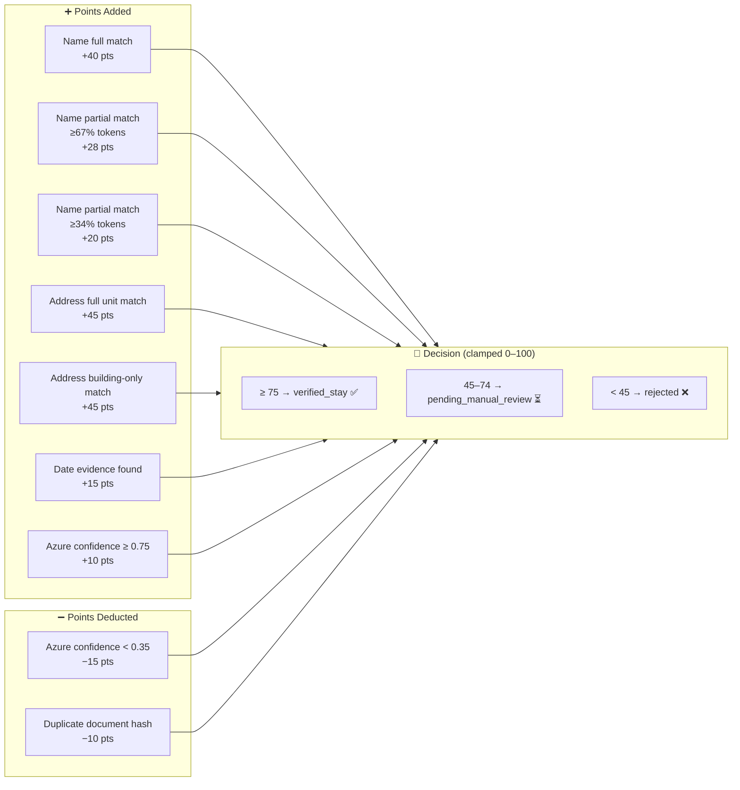
```mermaid
flowchart LR
    subgraph Positive["➕ Points Added"]
        N1["Name full match\n+40 pts"]
        N2["Name partial match\n≥67% tokens\n+28 pts"]
        N3["Name partial match\n≥34% tokens\n+20 pts"]
        A1["Address full unit match\n+45 pts"]
        A2["Address building-only match\n+45 pts"]
        D1["Date evidence found\n+15 pts"]
        C1["Azure confidence ≥ 0.75\n+10 pts"]
    end

    subgraph Negative["➖ Points Deducted"]
        C2["Azure confidence < 0.35\n−15 pts"]
        D2["Duplicate document hash\n−10 pts"]
    end

    subgraph Decision["🏁 Decision (clamped 0–100)"]
        V["≥ 75 → verified_stay ✅"]
        P["45–74 → pending_manual_review ⏳"]
        R["< 45 → rejected ❌"]
    end

    N1 & N2 & N3 & A1 & A2 & D1 & C1 --> Decision
    C2 & D2 --> Decision
```

**Name matching** uses **Levenshtein distance** — how many single-character edits (add, delete, replace) are needed to turn one string into another. A distance ≤ 4 is treated as a match, handling OCR typos and minor name variations. Matching is done token-by-token (first name, last name separately).

**Address matching** has three levels:
1. **Full match** — extracted address contains the property address including unit
2. **Building-only** — extracted address contains the street address without unit (common in bank statements)
3. **Reverse match** — property address contains the extracted text (happens when OCR only captures part of the address line)

---

### 6.6 Property Directory

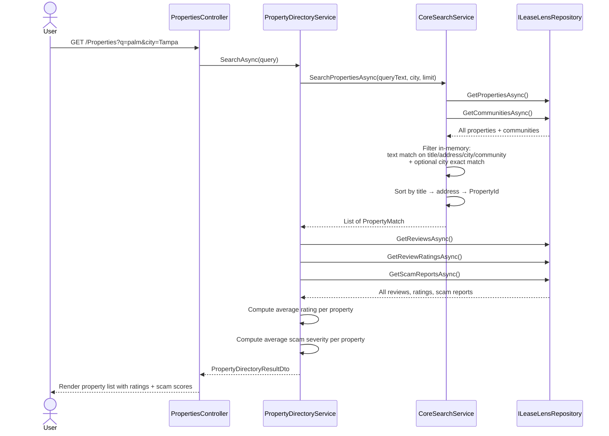
```mermaid
sequenceDiagram
    actor User
    participant Ctrl as PropertiesController
    participant PDS as PropertyDirectoryService
    participant CSS as CoreSearchService
    participant Repo as ILeaseLensRepository

    User->>Ctrl: GET /Properties?q=palm&city=Tampa

    Ctrl->>PDS: SearchAsync(query)
    PDS->>CSS: SearchPropertiesAsync(queryText, city, limit)
    CSS->>Repo: GetPropertiesAsync()
    CSS->>Repo: GetCommunitiesAsync()
    Repo-->>CSS: All properties + communities
    CSS->>CSS: Filter in-memory:<br/>text match on title/address/city/community<br/>+ optional city exact match
    CSS->>CSS: Sort by title → address → PropertyId
    CSS-->>PDS: List of PropertyMatch

    PDS->>Repo: GetReviewsAsync()
    PDS->>Repo: GetReviewRatingsAsync()
    PDS->>Repo: GetScamReportsAsync()
    Repo-->>PDS: All reviews, ratings, scam reports

    PDS->>PDS: Compute average rating per property
    PDS->>PDS: Compute average scam severity per property

    PDS-->>Ctrl: PropertyDirectoryResultDto
    Ctrl-->>User: Render property list with ratings + scam scores
```

**Property Detail Page:**

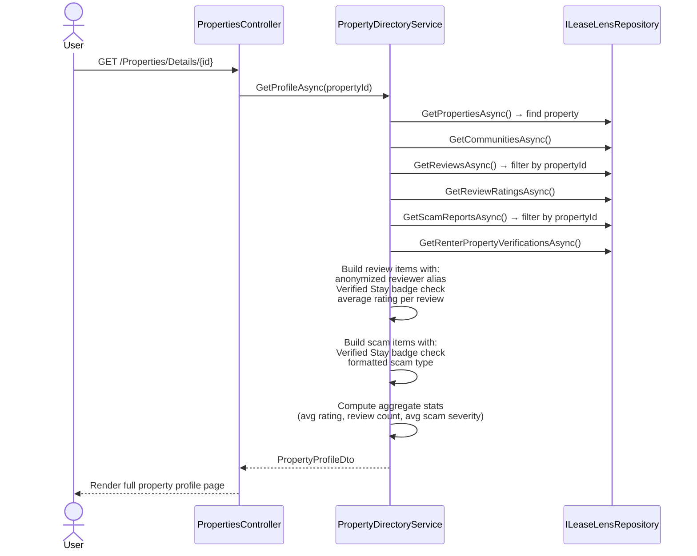
```mermaid
sequenceDiagram
    actor User
    participant Ctrl as PropertiesController
    participant PDS as PropertyDirectoryService
    participant Repo as ILeaseLensRepository

    User->>Ctrl: GET /Properties/Details/{id}
    Ctrl->>PDS: GetProfileAsync(propertyId)
    PDS->>Repo: GetPropertiesAsync() → find property
    PDS->>Repo: GetCommunitiesAsync()
    PDS->>Repo: GetReviewsAsync() → filter by propertyId
    PDS->>Repo: GetReviewRatingsAsync()
    PDS->>Repo: GetScamReportsAsync() → filter by propertyId
    PDS->>Repo: GetRenterPropertyVerificationsAsync()

    PDS->>PDS: Build review items with:<br/>anonymized reviewer alias<br/>Verified Stay badge check<br/>average rating per review

    PDS->>PDS: Build scam items with:<br/>Verified Stay badge check<br/>formatted scam type

    PDS->>PDS: Compute aggregate stats<br/>(avg rating, review count, avg scam severity)

    PDS-->>Ctrl: PropertyProfileDto
    Ctrl-->>User: Render full property profile page
```

---

### 6.7 Reviews

#### Viewing Reviews

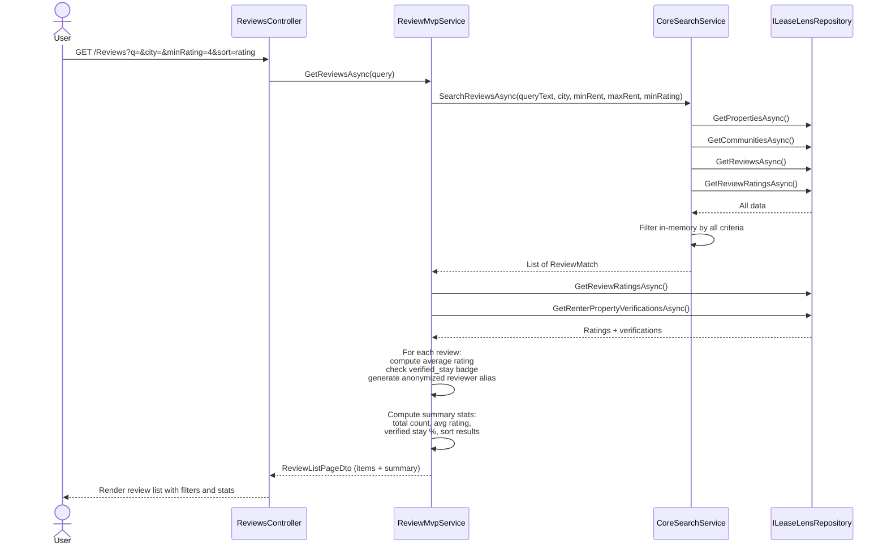
```mermaid
sequenceDiagram
    actor User
    participant Ctrl as ReviewsController
    participant RMS as ReviewMvpService
    participant CSS as CoreSearchService
    participant Repo as ILeaseLensRepository

    User->>Ctrl: GET /Reviews?q=&city=&minRating=4&sort=rating

    Ctrl->>RMS: GetReviewsAsync(query)
    RMS->>CSS: SearchReviewsAsync(queryText, city, minRent, maxRent, minRating)
    CSS->>Repo: GetPropertiesAsync()
    CSS->>Repo: GetCommunitiesAsync()
    CSS->>Repo: GetReviewsAsync()
    CSS->>Repo: GetReviewRatingsAsync()
    Repo-->>CSS: All data
    CSS->>CSS: Filter in-memory by all criteria
    CSS-->>RMS: List of ReviewMatch

    RMS->>Repo: GetReviewRatingsAsync()
    RMS->>Repo: GetRenterPropertyVerificationsAsync()
    Repo-->>RMS: Ratings + verifications

    RMS->>RMS: For each review:<br/>compute average rating<br/>check verified_stay badge<br/>generate anonymized reviewer alias

    RMS->>RMS: Compute summary stats:<br/>total count, avg rating,<br/>verified stay %, sort results

    RMS-->>Ctrl: ReviewListPageDto (items + summary)
    Ctrl-->>User: Render review list with filters and stats
```

#### Submitting a Review

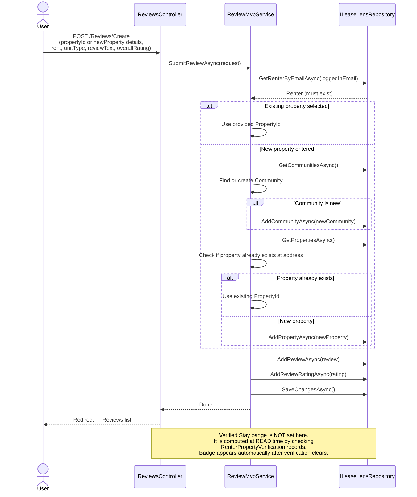
```mermaid
sequenceDiagram
    actor User
    participant Ctrl as ReviewsController
    participant RMS as ReviewMvpService
    participant Repo as ILeaseLensRepository

    User->>Ctrl: POST /Reviews/Create<br/>(propertyId or newProperty details,<br/>rent, unitType, reviewText, overallRating)

    Ctrl->>RMS: SubmitReviewAsync(request)
    RMS->>Repo: GetRenterByEmailAsync(loggedInEmail)
    Repo-->>RMS: Renter (must exist)

    alt Existing property selected
        RMS->>RMS: Use provided PropertyId
    else New property entered
        RMS->>Repo: GetCommunitiesAsync()
        RMS->>RMS: Find or create Community
        alt Community is new
            RMS->>Repo: AddCommunityAsync(newCommunity)
        end
        RMS->>Repo: GetPropertiesAsync()
        RMS->>RMS: Check if property already exists at address
        alt Property already exists
            RMS->>RMS: Use existing PropertyId
        else New property
            RMS->>Repo: AddPropertyAsync(newProperty)
        end
    end

    RMS->>Repo: AddReviewAsync(review)
    RMS->>Repo: AddReviewRatingAsync(rating)
    RMS->>Repo: SaveChangesAsync()

    RMS-->>Ctrl: Done
    Ctrl-->>User: Redirect → Reviews list

    Note over Ctrl,Repo: Verified Stay badge is NOT set here.<br/>It is computed at READ time by checking<br/>RenterPropertyVerification records.<br/>Badge appears automatically after verification clears.
```

---

### 6.8 Scam Reports

Scam reports follow the same architecture as reviews. The flow is parallel by design.

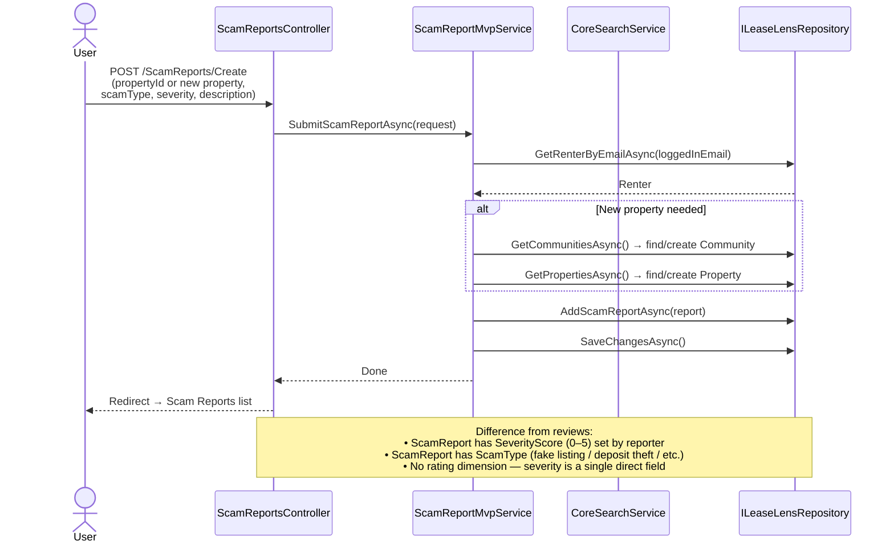
```mermaid
sequenceDiagram
    actor User
    participant Ctrl as ScamReportsController
    participant SMS as ScamReportMvpService
    participant CSS as CoreSearchService
    participant Repo as ILeaseLensRepository

    User->>Ctrl: POST /ScamReports/Create<br/>(propertyId or new property,<br/>scamType, severity, description)

    Ctrl->>SMS: SubmitScamReportAsync(request)
    SMS->>Repo: GetRenterByEmailAsync(loggedInEmail)
    Repo-->>SMS: Renter

    alt New property needed
        SMS->>Repo: GetCommunitiesAsync() → find/create Community
        SMS->>Repo: GetPropertiesAsync() → find/create Property
    end

    SMS->>Repo: AddScamReportAsync(report)
    SMS->>Repo: SaveChangesAsync()
    SMS-->>Ctrl: Done

    Ctrl-->>User: Redirect → Scam Reports list

    Note over Ctrl,Repo: Difference from reviews:<br/>• ScamReport has SeverityScore (0–5) set by reporter<br/>• ScamReport has ScamType (fake listing / deposit theft / etc.)<br/>• No rating dimension — severity is a single direct field
```

---

### 6.9 Reputation System

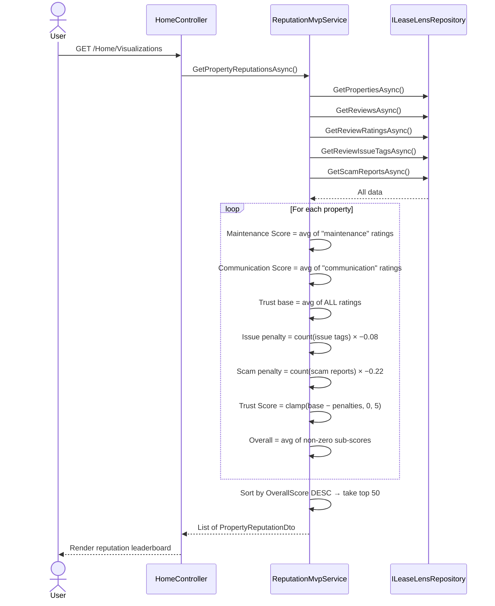
```mermaid
sequenceDiagram
    actor User
    participant Ctrl as HomeController
    participant RMS as ReputationMvpService
    participant Repo as ILeaseLensRepository

    User->>Ctrl: GET /Home/Visualizations

    Ctrl->>RMS: GetPropertyReputationsAsync()
    RMS->>Repo: GetPropertiesAsync()
    RMS->>Repo: GetReviewsAsync()
    RMS->>Repo: GetReviewRatingsAsync()
    RMS->>Repo: GetReviewIssueTagsAsync()
    RMS->>Repo: GetScamReportsAsync()
    Repo-->>RMS: All data

    loop For each property
        RMS->>RMS: Maintenance Score = avg of "maintenance" ratings
        RMS->>RMS: Communication Score = avg of "communication" ratings
        RMS->>RMS: Trust base = avg of ALL ratings
        RMS->>RMS: Issue penalty = count(issue tags) × −0.08
        RMS->>RMS: Scam penalty = count(scam reports) × −0.22
        RMS->>RMS: Trust Score = clamp(base − penalties, 0, 5)
        RMS->>RMS: Overall = avg of non-zero sub-scores
    end

    RMS->>RMS: Sort by OverallScore DESC → take top 50
    RMS-->>Ctrl: List of PropertyReputationDto

    Ctrl-->>User: Render reputation leaderboard
```

**Scoring model visualized:**

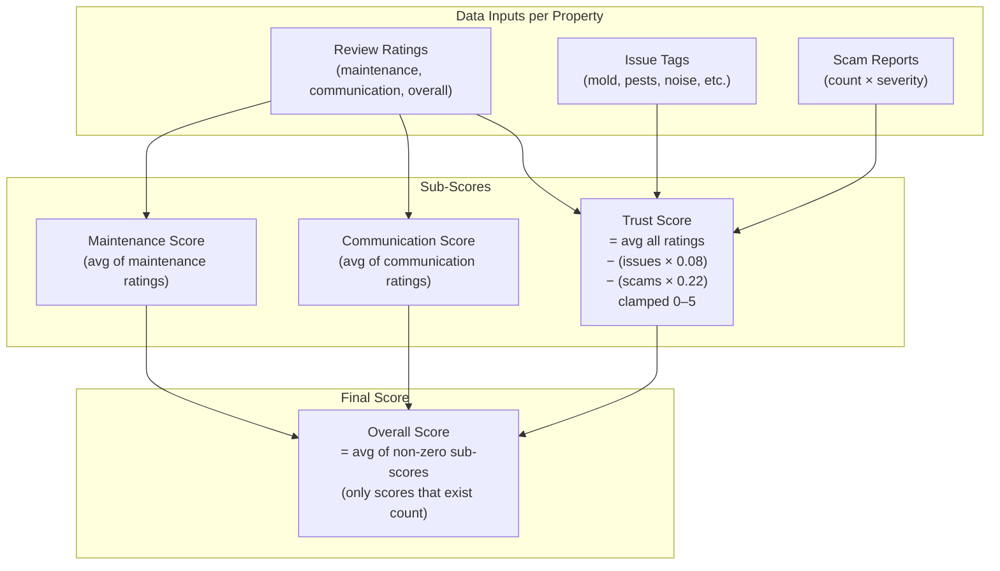
```mermaid
flowchart TD
    subgraph Inputs["Data Inputs per Property"]
        R["Review Ratings\n(maintenance, communication, overall)"]
        I["Issue Tags\n(mold, pests, noise, etc.)"]
        S["Scam Reports\n(count × severity)"]
    end

    subgraph Scores["Sub-Scores"]
        M["Maintenance Score\n(avg of maintenance ratings)"]
        C["Communication Score\n(avg of communication ratings)"]
        T["Trust Score\n= avg all ratings\n− (issues × 0.08)\n− (scams × 0.22)\nclamped 0–5"]
    end

    subgraph Final["Final Score"]
        O["Overall Score\n= avg of non-zero sub-scores\n(only scores that exist count)"]
    end

    R --> M
    R --> C
    R --> T
    I --> T
    S --> T
    M --> O
    C --> O
    T --> O
```

---

### 6.10 Search

The `CoreSearchService` is a shared in-memory search engine used by all features. It does not generate SQL `WHERE` clauses — it loads all data and filters it with LINQ in C#.

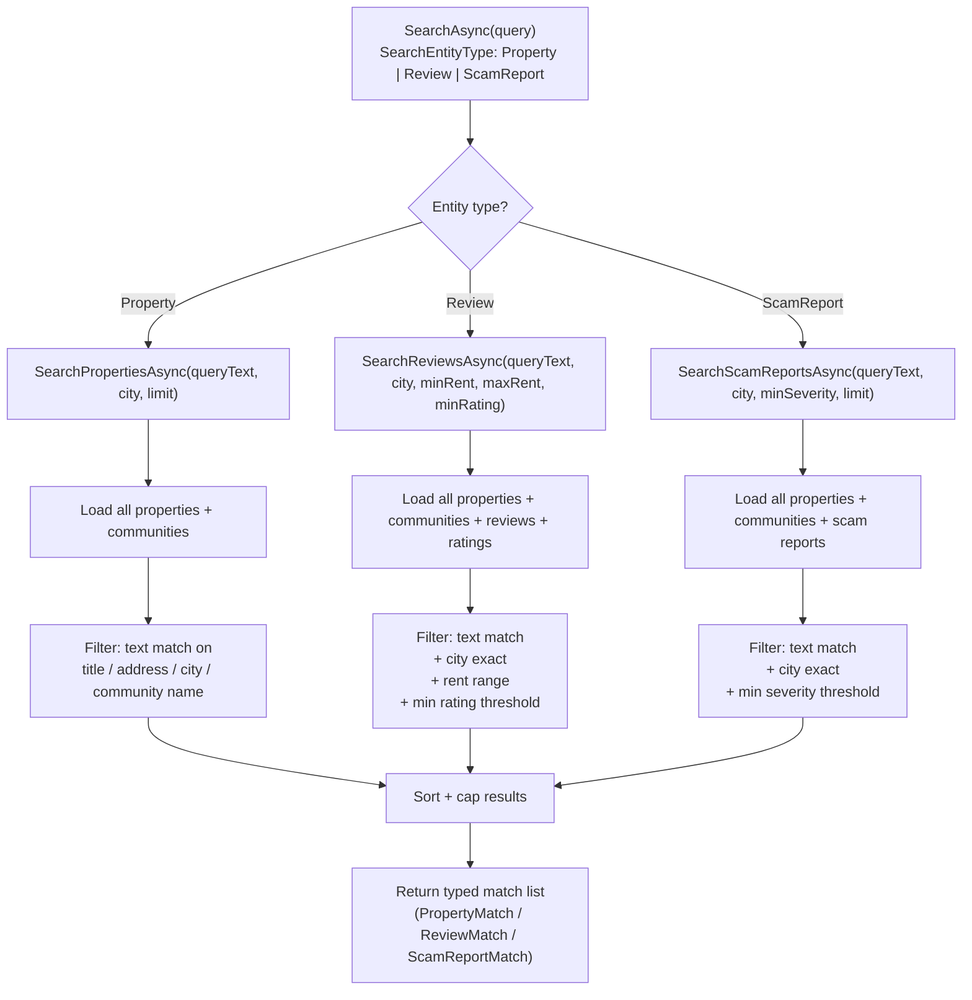
```mermaid
flowchart TD
    A["SearchAsync(query)\nSearchEntityType: Property | Review | ScamReport"] --> B{Entity type?}

    B -->|Property| C["SearchPropertiesAsync(queryText, city, limit)"]
    B -->|Review| D["SearchReviewsAsync(queryText, city, minRent, maxRent, minRating)"]
    B -->|ScamReport| E["SearchScamReportsAsync(queryText, city, minSeverity, limit)"]

    C --> F["Load all properties + communities"]
    D --> G["Load all properties + communities + reviews + ratings"]
    E --> H["Load all properties + communities + scam reports"]

    F --> I["Filter: text match on\ntitle / address / city / community name"]
    G --> J["Filter: text match\n+ city exact\n+ rent range\n+ min rating threshold"]
    H --> K["Filter: text match\n+ city exact\n+ min severity threshold"]

    I & J & K --> L["Sort + cap results"]
    L --> M["Return typed match list\n(PropertyMatch / ReviewMatch / ScamReportMatch)"]
```

> **Why in-memory?** At the current scale (hundreds to low-thousands of records), in-memory LINQ is fast enough and far simpler to maintain than complex EF Core queries. The trade-off is clear and intentional — the code documents this in the Q&A section.

---

### 6.11 Lease Summarizer

The Lease Summarizer lets an authenticated renter upload a lease PDF (or image) and receive an AI-generated breakdown in seconds. It uses the same Azure AI Foundry LLM already integrated for residency verification, but with a dedicated system prompt and a much richer structured output schema.

#### Architecture Overview

```mermaid
flowchart TD
    A["User uploads lease\n(PDF / PNG / JPEG, max 10 MB)\nGET /LeaseSummarizer"] --> B["LeaseSummarizerController\nPOST /LeaseSummarizer/Submit"]

    B --> C["Validate file:\n• Extension = .pdf / .png / .jpg / .jpeg\n• Size ≤ 10 MB\n• Content-Type check"]
    C --> D["SHA-256 hash file bytes"]
    D --> E["Create LeaseDocument record\n+ LeaseSummarizationJob (status=queued)\nSave to DB"]
    E --> F["Enqueue LeaseSummarizationJobRequest\nto ILeaseSummarizationQueue\n(in-memory Channel)"]
    F --> G["Redirect → /LeaseSummarizer/Status/{jobId}\n(polling page)"]

    subgraph Background["Background Thread — LeaseSummarizationWorker"]
        H["DequeueAsync()\ngets job request"]
        I["IDocumentExtractionService\nAzure Document Intelligence\nRun 'prebuilt-layout' OCR → raw text"]
        J["ILeaseSummarizationLlmClient\nAzureFoundryLeaseSummarizationLlmClient\nPOST to Azure AI Foundry with system prompt"]
        K["Parse structured JSON response:\nconfidence, premises, parties, term,\nmoney, notices, moveOut, highlights, clauseFlags"]
        L["Create LeaseAnalysis record\n+ LeaseClauseFlag records\nUpdate job status=succeeded"]
        M["On error: update job status=failed\nLog to ILlmFoundryErrorFileLog"]
    end

    F --> H
    H --> I
    I --> J
    J --> K
    K --> L
```

#### Real-Time Status Polling

The Status page polls `/LeaseSummarizer/StatusJson?id={jobId}` every 2 seconds. The API endpoint returns JSON with the current job status and, when complete, the full structured summary and clause flags. The JavaScript on the page renders the response into formatted HTML sections without a full page reload.

```mermaid
sequenceDiagram
    actor User
    participant Browser
    participant Ctrl as LeaseSummarizerController
    participant Repo as ILeaseLensRepository

    User->>Browser: GET /LeaseSummarizer/Status/{jobId}
    Browser->>Browser: Render "Queued…" placeholder

    loop Every 2 seconds until succeeded or failed
        Browser->>Ctrl: GET /LeaseSummarizer/StatusJson?id={jobId}
        Ctrl->>Repo: Load LeaseSummarizationJob
        Ctrl->>Repo: Load LeaseAnalysis + ClauseFlags (if complete)
        Ctrl-->>Browser: JSON { status, summaryText, structuredSummaryJson, clauseFlags }
        Browser->>Browser: Update status label + render summary sections
    end

    alt status = succeeded
        Browser->>Browser: Render full structured summary\n(property, parties, term, financials,\nutilities, notices, move-out, clause flags)
    else status = failed
        Browser->>Browser: Show error message
    end
```

#### What the LLM Returns

The system prompt instructs the LLM to output a strict JSON schema. Key sections:

| Section | What it contains |
|---|---|
| `confidence` | 0–1 float — how confident the model is in the extraction |
| `premises` | Full address, street, city, state, postal code, country |
| `parties` | Landlord name, property manager, list of tenant names |
| `term` | Start date, end date, months, renewal type, early termination clause |
| `money` | Monthly rent (amount, due date, grace period), security deposit, other deposits, late fees, NSF fees, recurring charges, one-time fees |
| `utilities` | Per-utility breakdown of who pays (landlord vs tenant) |
| `notices` | Move-out notice days, termination notice days, entry notice hours, rent increase notice days |
| `moveOut` | Cleaning requirements, repair deduction policy, required professional services |
| `highlights` | Key facts the renter should know |
| `clauseFlags` | Array of risky clauses, each with: `clauseType`, `riskLevel` (high / medium / low), `flaggedText`, `explanation`, `suggestedQuestion` |

#### Security for File Uploads

The same security pipeline applies here as for residency verification:
- File size and content-type validation before processing
- File bytes held in memory only (never written to disk or file system)
- SHA-256 hashing stored on `LeaseDocument` for traceability
- `[Authorize]` — only authenticated renters can access this feature
- Anti-forgery token on the upload form

#### Background Worker Pattern

`LeaseSummarizationWorker` is a .NET `BackgroundService` — it runs as a long-lived thread alongside the web app. It continuously calls `DequeueAsync()` on the `ILeaseSummarizationQueue` (backed by a `System.Threading.Channels.Channel<T>`), processes each job, and updates the database. This decouples the HTTP response from the LLM call, which can take 10–30 seconds. The user gets an instant redirect to the status page while the work happens in the background.

```mermaid
flowchart LR
    A["HTTP Request\n(file upload)"] -->|"completes in < 1s"| B["Redirect to Status page"]
    A --> C["Job enqueued in Channel"]
    C --> D["LeaseSummarizationWorker\n(background thread)"]
    D -->|"processes in 10-30s"| E["DB updated to succeeded/failed"]
    B --> F["Polling JS\nchecks DB via StatusJson endpoint"]
    E --> F
```

---

## 7. External Services

### Azure Key Vault — Startup Secrets Loading

```mermaid
sequenceDiagram
    participant App as Program.cs
    participant KVL as KeyVaultSecretLoader
    participant MI as Azure Managed Identity
    participant KV as Azure Key Vault

    App->>KVL: ApplyAsync(configuration)
    KVL->>MI: Request access token for Key Vault
    MI-->>KVL: Access token (no credentials stored anywhere)
    KVL->>KV: List all secrets
    KV-->>KVL: Secret names
    KVL->>KV: Get each secret value
    KV-->>KVL: Secret values (connection strings, API keys, Gmail password)
    KVL->>App: Inject into IConfiguration
    Note over App: Rest of startup proceeds with secrets available.<br/>appsettings.json contains NO sensitive data.
```

### Gmail SMTP — Email Delivery

```mermaid
flowchart LR
    A["Email trigger event:\n1. Registration\n2. Resend verify\n3. Verification in progress\n4. Residency decision"] --> B["GmailEmailVerificationSender"]
    B --> C["Build HTML + plain text\nalternate views"]
    C --> D["SmtpClient\nhost: smtp.gmail.com\nport: 587\nSSL: true"]
    D --> E["Authenticate with\nGmail App Password\n(from Key Vault)"]
    E --> F["📧 Email delivered to renter"]
```

### Azure Document Intelligence + LLM Fallback

```mermaid
flowchart TD
    A["Document uploaded\n(PDF / PNG / JPEG)"] --> B["Select model by document type:\nbank_statement → bank model\nutility_bill → utility model\nlease → lease model\ndefault → prebuilt-layout"]

    B --> C["Azure Document Intelligence\nAnalyzeDocumentAsync()"]

    C --> D["Extract structured fields:\nName: AccountHolderName /\nCustomerName / TenantName\nAddress: ServiceAddress /\nBillingAddress / PropertyAddress"]

    D --> E{"Meets quality bar?\nname + address present\nconfidence ≥ threshold\nnot a lease document"}

    E -->|"Yes"| F["Return extraction immediately\nto scoring algorithm"]

    E -->|"No"| G["Background fallback:\n1. Run prebuilt-layout OCR\n2. Send layout text to LLM"]

    G --> H["Azure AI Foundry LLM\nPrompt: extract tenant names\nand address from this text"]

    H --> I["LLM returns:\n{ tenants: ['John Smith'],\n  address: '123 Main St',\n  confidence: 0.91 }"]

    I --> F
```

---

## 8. Security

### Authentication & Authorization

```mermaid
flowchart LR
    A["User Password"] --> B["ASP.NET Identity\nPBKDF2 hashing"]
    B --> C["Stored hash in AuthDbContext\n(never plaintext)"]

    D["All POST forms"] --> E["[ValidateAntiForgeryToken]\nPrevents CSRF attacks"]

    F["Protected pages\n/Profile, /Reviews/Create, etc."] --> G["[Authorize] attribute\nRedirects to /Account/Login\nif no auth cookie"]
```

### File Upload Security

```mermaid
flowchart TD
    A["File uploaded"] --> B{"Size ≤ 10 MB?"}
    B -->|No| Z1["Reject: 'File too large'"]
    B -->|Yes| C{"Content-Type is\nPDF / PNG / JPEG?"}
    C -->|No| Z2["Reject: 'Unsupported file type'"]
    C -->|Yes| D["Read bytes into memory\n(never saved to disk)"]
    D --> E["SHA-256 hash file bytes"]
    E --> F["Check for duplicate hash\nin ResidencyVerificationDocuments"]
    F --> G["Send to Azure for processing"]
    G --> H{"Duplicate hash found?"}
    H -->|Yes| I["Apply −10 confidence penalty"]
    H -->|No| J["Normal scoring"]
```

### Name Lock (Anti-Gaming)

```mermaid
flowchart TD
    A["User requests profile update\n(display name change)"] --> B{"Has any\nverified_stay record?"}
    B -->|"No — not yet verified"| C["Allow name change\nUpdate Renter.DisplayName"]
    B -->|"Yes — verified renter"| D{"New name same\nas current name?"}
    D -->|"Yes"| E["Allow (no change)"]
    D -->|"No"| F["Reject: 'Name cannot be edited\nafter Verified Stay'"]
```

---

## 9. How the App Starts Up

```mermaid
sequenceDiagram
    participant OS as Operating System
    participant Main as Program.cs
    participant KV as Azure Key Vault
    participant DI as DI Container
    participant DB as SQL Server

    OS->>Main: dotnet run / App Service starts

    Main->>KV: KeyVaultSecretLoader.ApplyAsync()<br/>Pull all secrets via Managed Identity
    KV-->>Main: Secrets injected into IConfiguration

    Main->>DI: builder.Services.AddControllersWithViews()
    Main->>DI: AddApplication() — register all 9 services
    Main->>DI: AddInfrastructure() — register EF Core contexts + ILeaseLensRepository
    Main->>DI: Register Gmail, Azure Document Intelligence, LLM client
    Main->>DI: Register ResidencyFallbackQueue (singleton)
    Main->>DI: AddHostedService<ResidencyFallbackWorker>()
    Main->>DI: AddHttpClient<ILeaseSummarizationLlmClient, AzureFoundryLeaseSummarizationLlmClient>()
    Main->>DI: Register LeaseSummarizationQueue (singleton Channel-backed)
    Main->>DI: AddHostedService<LeaseSummarizationWorker>()
    Main->>DI: AddIdentity<IdentityUser>() with password policy

    Main->>Main: Build middleware pipeline:<br/>HTTPS redirect → Routing → Authentication → Authorization → Static files → Controllers

    Main->>Main: Map GET /health/db endpoint

    alt Development environment
        Main->>DB: AuthDbContext — EnsureCreated() for Identity schema
    end

    Main->>Main: app.RunAsync() — start listening on port 443

    Note over Main: ResidencyFallbackWorker starts as<br/>background thread, waiting for jobs
```

---

## 10. Common Professor Questions — Answered

**Q: Why did you choose Clean Architecture?**  
A: It separates concerns clearly into four layers with a strict dependency rule. The Application layer defines what the app does; Infrastructure defines how data is stored; Web handles the UI. Each layer can change independently. It also makes the codebase explainable — anyone can read the Application layer and understand business logic without needing to know EF Core or Azure.

**Q: Why ASP.NET Core MVC instead of a REST API + React?**  
A: MVC with server-rendered Razor views is simpler for a team-sized academic project. There is no API/frontend boundary to maintain, no CORS issues, no separate build pipeline. The trade-off is less UI interactivity — but our features do not require real-time updates, so it is the right tool.

**Q: How does the Verified Stay badge work? Can it be gamed?**  
A: The badge requires uploading a document (bank statement, utility bill, or lease) that contains both the user's name and their listed property address. Azure Document Intelligence + an LLM extract those fields. The system scores the match using Levenshtein name matching (handles OCR typos) and three-level address matching. SHA-256 hashing prevents re-submitting the same document. Name lock prevents changing identity after verification. This raises the cost of a fake badge significantly — you would need a real document showing someone else's name at the claimed address.

**Q: What is `ILeaseLensRepository` and why does it exist?**  
A: It is an interface in the Application layer that declares every database operation the business logic needs. Infrastructure's `LeaseLensDbContext` implements it using EF Core. This means Application services are decoupled from EF Core — they never import it, never know SQL Server is being used. If we switched databases, only Infrastructure changes.

**Q: Why are there two separate database contexts?**  
A: ASP.NET Identity (`AuthDbContext`) manages authentication — users, hashed passwords, tokens. The application context (`LeaseLensDbContext`) manages all business data — properties, reviews, verifications. Keeping them separate means the auth system can evolve independently and we avoid mixing authentication concerns with business data.

**Q: What happens if Azure Document Intelligence is down?**  
A: The extraction service throws an exception, caught in `ProfileController`. The user sees a clear error message. We do not silently fail or give a false verification.

**Q: Why is there a background fallback queue?**  
A: Some documents (especially leases) are too complex for structured Azure models within a web request's time budget. The `ResidencyFallbackQueue` accepts the job immediately, sends the user an "in progress" email, and `ResidencyFallbackWorker` (a .NET `BackgroundService`) processes it using a heavier two-step pipeline: layout OCR followed by an LLM call. The user gets a final decision email when done.

**Q: How does the reputation score work?**  
A: Three sub-scores per property — Maintenance, Communication, Trust. Trust is penalized per issue tag (−0.08) and per scam report (−0.22) because scams are a more severe signal. The Overall score averages only non-zero sub-scores — missing data (no maintenance reviews) does not unfairly penalize a property.

**Q: How is the search implemented? Why not SQL?**  
A: `CoreSearchService` loads all data from the repository and filters it in memory using LINQ. At our scale (hundreds to low-thousands of records), this is fast and simple. The trade-off is that it does not scale to millions of records — at that point we would move to SQL Server Full-Text Search or a dedicated search engine like Elasticsearch. We chose simplicity now.

**Q: How are reviewer identities kept anonymous?**  
A: `RenterId` is stored on `Review` internally for verification matching and duplicate detection — but it is never shown in the UI. `AnonymizedNameGenerator.Generate(review.ReviewId)` creates a deterministic alias from the `ReviewId` (e.g., "Renter #7F3A"). The same reviewer always gets the same alias, but it cannot be reversed to find the real user.

**Q: What happens if a renter submits a review before their residency is verified?**  
A: The review is saved without a badge. The Verified Stay badge is computed at read time — when reviews load, the system checks for a `verified_stay` record matching that renter + property. If the user verifies later, the badge appears on their existing review automatically with no action required.

**Q: How is email sent? What if Gmail SMTP fails?**  
A: `GmailEmailVerificationSender` uses .NET's `SmtpClient` with TLS on port 587, authenticated with a Gmail App Password stored in Azure Key Vault. For registration, email failure is caught and the user sees a warning ("Account created but email could not be sent"). For residency decisions in the background worker, failure is logged. We chose Gmail SMTP for simplicity — a production system would use SendGrid or Azure Communication Services for reliability and deliverability.

**Q: How are secrets managed? Is anything hardcoded?**  
A: No secrets are hardcoded or in `appsettings.json`. All API keys, connection strings, and passwords are stored in Azure Key Vault. At startup, `KeyVaultSecretLoader` connects to Key Vault using the app's Managed Identity (no credentials needed) and injects all secrets into the configuration system. The rest of the app reads them as normal config values.

**Q: What is the flow of DI (Dependency Injection)?**  
A: `Program.cs` registers all services with the DI container. When a controller is instantiated for a request, ASP.NET automatically injects the requested service interfaces. For example, `ReviewsController` receives `IReviewMvpService`, which at runtime is `ReviewMvpService`, which receives `ILeaseLensRepository`, which at runtime is `LeaseLensDbContext`. Nothing is hardcoded — it is all wired by the container.

**Q: How does the Lease Summarizer work end-to-end?**  
A: The user uploads a lease file (PDF/PNG/JPEG, max 10 MB). The controller validates the file, stores metadata in the database (status = "queued"), and immediately enqueues the job to an in-memory `Channel<T>`. The user is redirected to a status page that polls `/LeaseSummarizer/StatusJson` every 2 seconds. Meanwhile, `LeaseSummarizationWorker` (a `BackgroundService`) dequeues the job, runs Azure Document Intelligence to get clean OCR text, calls the Azure AI Foundry LLM with a detailed system prompt, parses the structured JSON response, and saves the `LeaseAnalysis` + `LeaseClauseFlag` records to the database. The next poll from the browser sees `status = "succeeded"` and renders the full summary.

**Q: Why use an in-memory Channel for the lease summarizer instead of sending to Azure directly in the HTTP request?**  
A: An LLM call can take 10–30 seconds depending on lease length and model latency. Holding an HTTP connection open that long is a bad user experience and may hit proxy timeouts. The `Channel<T>` pattern decouples the upload (< 1 second) from the analysis (several seconds), letting the user navigate to a polling status page immediately. It also lets us retry and log failures cleanly in the background worker without affecting the HTTP response.

**Q: What LLM prompt drives the Lease Summarizer?**  
A: The system prompt (`Prompts/lease_summarizer_system_prompt.txt`) instructs the model to return a strict JSON schema. It defines every field: `confidence`, `premises`, `parties`, `term`, `money` (rent, deposits, fees, utilities), `notices`, `moveOut`, `highlights`, and `clauseFlags`. Each clause flag must include a `riskLevel` (high/medium/low), the exact `flaggedText`, a plain-English `explanation`, and a `suggestedQuestion` the renter should ask the landlord. This structured output makes parsing deterministic and lets the UI render each section independently.

**Q: What happens if the LLM fails or returns invalid JSON?**  
A: `AzureFoundryLeaseSummarizationLlmClient` has configurable retry logic with exponential backoff for HTTP 429 and 5xx responses. If parsing fails (invalid JSON, missing required fields), the exception is caught in `LeaseSummarizationWorker`, the job's `Status` is set to `"failed"`, and the error is written to `ILlmFoundryErrorFileLog` with context. The user sees a clear failure message on the status page.

**Q: Can the same lease file be summarized twice?**  
A: Yes — the SHA-256 hash is stored on `LeaseDocument` for traceability, but unlike the residency verification flow there is no duplicate-hash penalty for lease summarization. Each upload creates a new job and analysis. This is intentional: a renter might want to re-analyze after a landlord sends a revised lease.

**Q: How does the Lease Summarizer relate to the Residency Verification? Are they the same feature?**  
A: They share the same Azure infrastructure (Document Intelligence for OCR, Azure AI Foundry for LLM) but serve different purposes. Residency Verification checks whether a *renter* lived at a *specific property* — it extracts name, address, and date from proof documents and scores the match. The Lease Summarizer analyzes a *lease document* to help the renter understand what they are about to sign — it extracts contract terms, financial obligations, and risk clauses. The verification path is synchronous (or near-synchronous via `ResidencyFallbackWorker`); the lease path is always async via `LeaseSummarizationWorker`.

---

*Documentation generated May 2026. Reflects the current state of the LeaseLense codebase including the Lease Summarizer feature.*
