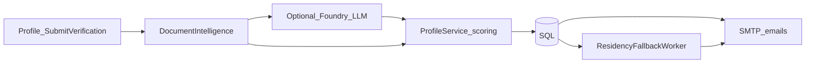

# Address and residency verification

This document describes how LeaseLense verifies that a renter’s uploaded document matches the name and address on their profile, and how statuses are assigned.

## End-to-end flow

1. **Submit** — The renter uploads a PDF/image from **Profile** ([`ProfileController.SubmitVerification`](../src/LeaseLense.Web/Controllers/ProfileController.cs)). The saved **account address** is used as the target property address (and may create or match a [`Property`](../src/LeaseLense.Domain/Entities/Property.cs)).
2. **OCR / extraction** — [`IDocumentExtractionService`](../src/LeaseLense.Web/Services/IDocumentExtractionService.cs) ([`AzureDocumentIntelligenceExtractionService`](../src/LeaseLense.Web/Services/AzureDocumentIntelligenceExtractionService.cs)) extracts text and structured fields. If confidence is low, an optional **LLM fallback** ([`AzureFoundryAddressExtractionLlmClient`](../src/LeaseLense.Web/Services/AzureFoundryAddressExtractionLlmClient.cs)) may infer tenants and address JSON.
3. **Scoring and decision** — [`ProfileService.SubmitResidencyVerificationAsync`](../src/LeaseLense.Application/Services/ProfileService.cs) computes a **confidence score** (0–100) from name match, address match, date evidence, duplicate-hash penalty, and parser confidence. It sets `verified_stay`, `pending_manual_review`, or `rejected`, and stores an internal `ReviewReason` string.
4. **Persistence** — [`RenterPropertyVerification`](../src/LeaseLense.Domain/Entities/RenterPropertyVerification.cs) and [`ResidencyVerificationDocument`](../src/LeaseLense.Domain/Entities/ResidencyVerificationDocument.cs) record the outcome and extracted fields.
5. **Email** — [`GmailEmailVerificationSender`](../src/LeaseLense.Web/Services/GmailEmailVerificationSender.cs) sends themed HTML (and plain-text) updates. **Customer-facing** copy uses [`ResidencyVerificationDisplayHelper`](../src/LeaseLense.Application/Profile/ResidencyVerificationDisplayHelper.cs); internal `ReviewReason` is not shown verbatim on Profile or in emails.
6. **Background fallback** — If enabled, [`ResidencyFallbackWorker`](../src/LeaseLense.Web/Services/ResidencyFallbackWorker.cs) can re-run extraction and send a decision email when the async path completes.

## Name matching (summary)

- Names are normalized (uppercase, non-alphanumeric stripped, tokenized).
- **Full or substring containment** between expected and extracted names yields a strong name score.
- Otherwise **token coverage** is scored using **Levenshtein distance** (threshold 4) per token; coverage tiers map to partial name points.

## Address matching (summary)

- Addresses are normalized (uppercase, punctuation simplified, `#` treated as unit marker).
- **Full line match** — extracted line contains the property street line.
- **Building-only** — unit markers (`APT`, `UNIT`, `STE`, etc.) are stripped on both sides; building portion must match in one direction or the other (**reverse** match allowed for OCR line order).

## Confidence and status thresholds

Implemented in `ProfileService.SubmitResidencyVerificationAsync`:

| Behavior | Condition (simplified) |
|----------|-------------------------|
| **verified_stay** | Score **≥ 75** (after clamps), with name/address rules satisfied for the branch that leads to high score |
| **pending_manual_review** | Inconclusive extraction, name not matched, intermediate scores, or score in review band |
| **rejected** | Low confidence path (e.g. below thresholds after rules), or duplicate document hash per internal logic |

Exact branching uses `hasExtraction`, `nameMatched`, `addressMatched`, and the computed `confidence` variable; read the source for edge cases.

## Customer-facing summaries

[`ResidencyVerificationDisplayHelper.BuildCustomerSummary`](../src/LeaseLense.Application/Profile/ResidencyVerificationDisplayHelper.cs) maps status (and whether anything was extracted) to short text for **Profile history** and **emails**. This avoids exposing internal scoring strings.

## Operations and observability

- **LLM / Foundry errors** — Logged to structured files via [`LlmFoundryErrorFileLog`](../src/LeaseLense.Web/Services/LlmFoundryErrorFileLog.cs) (see [`LlmFoundryFileLogging`](../src/LeaseLense.Web/Services/LlmFoundryFileLoggingOptions.cs) in configuration). File logging and dev JSONL artifacts must **not** break the extraction path (see Foundry client try/catch and secondary logging guards).
- **Dev artifacts** — Optional append-only history under `src/LeaseLense.Web/artifacts/` for raw/parsed LLM output in development; not required for production correctness.

## Configuration and secrets

See [configuration.md](./configuration.md) for local setup, **production** (Key Vault, Managed Identity, what stays in `appsettings` vs the vault), and **`KeyVaultSecretMappings`**.
